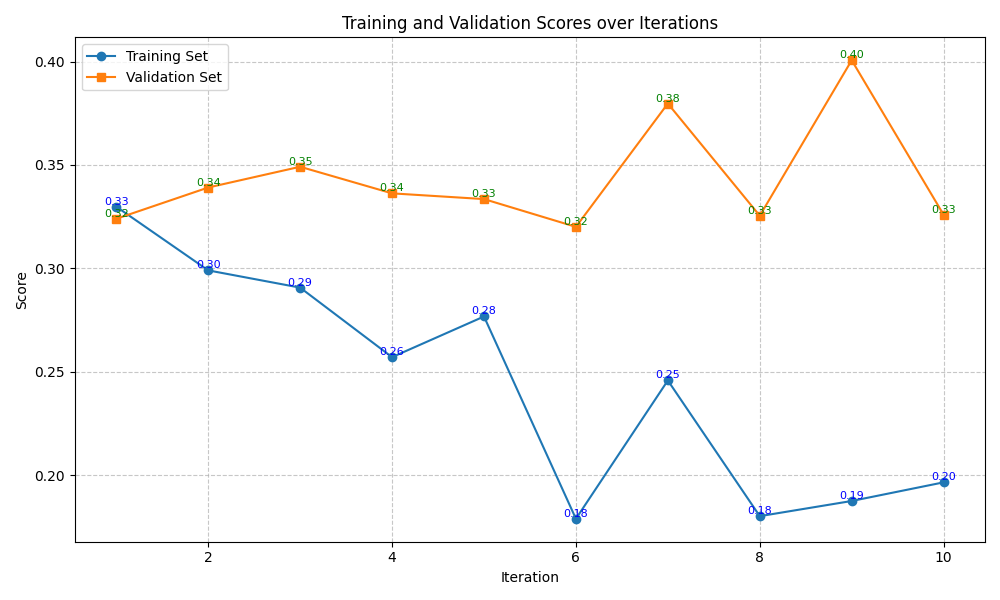
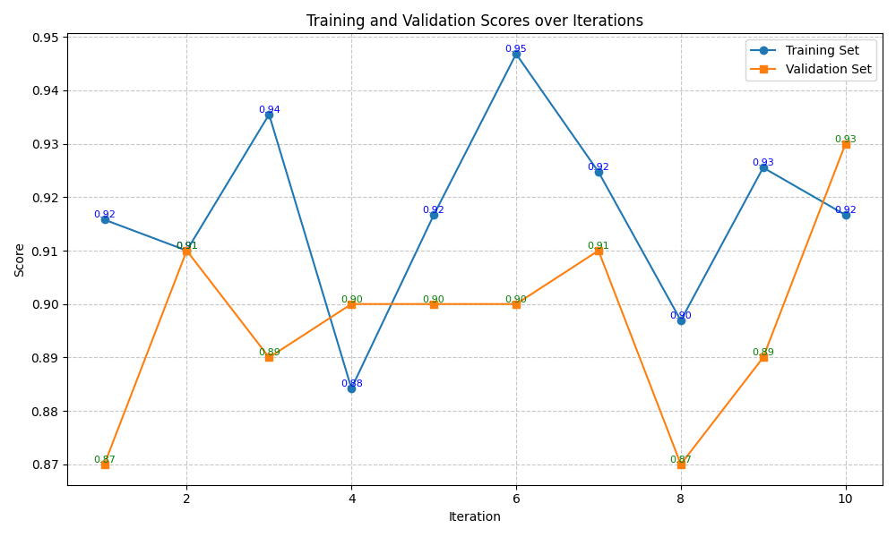
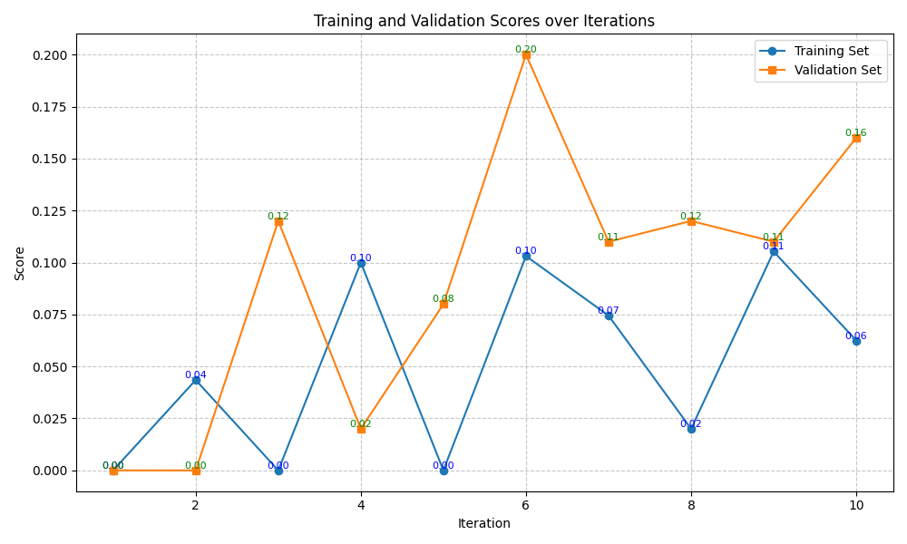
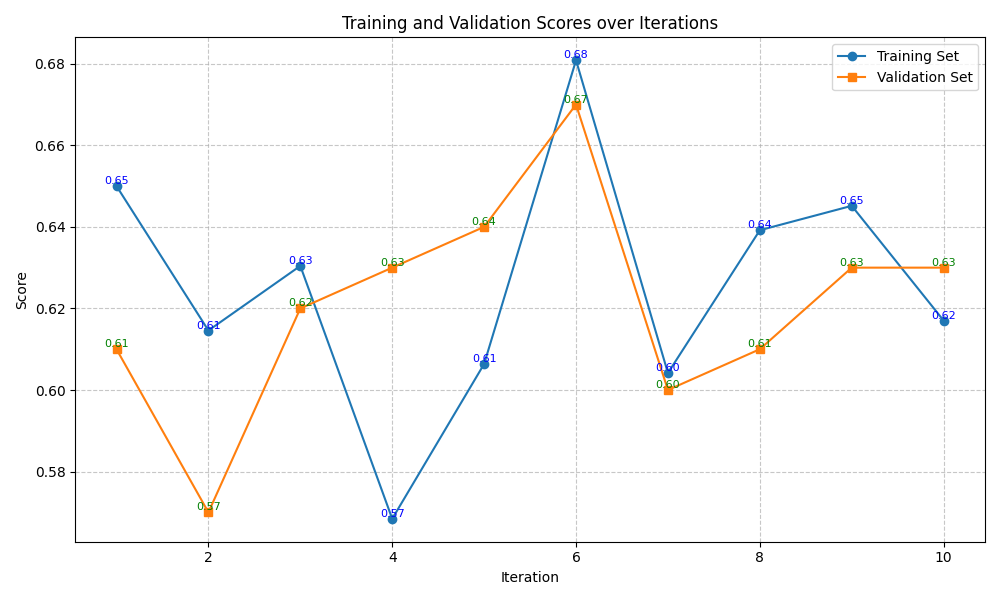
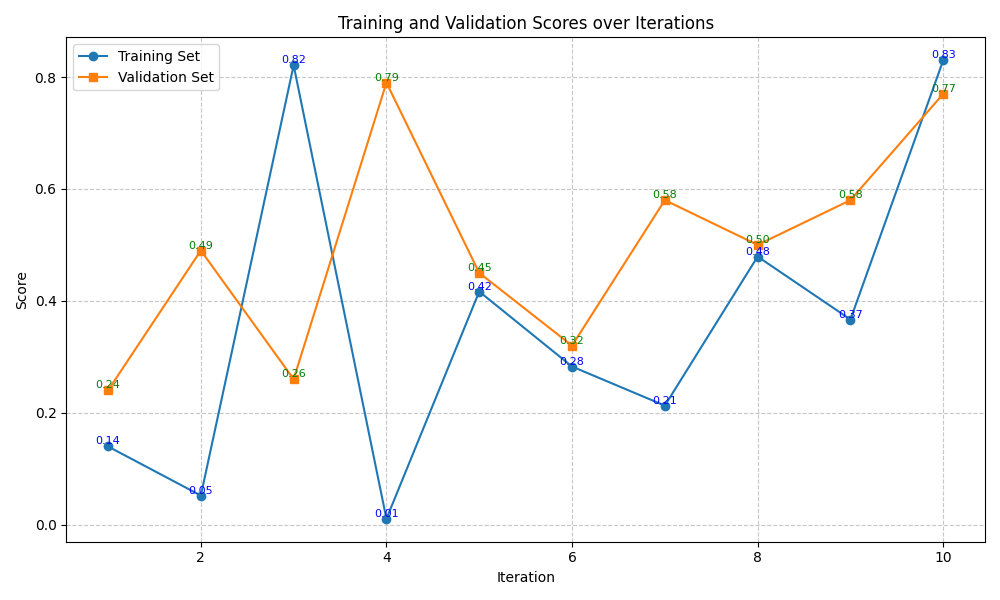

# FewShotTrainer Result

## Summary

### Trainset Scores

| Benchmarks \ Methods                   | Baseline | finetuned baseline                        | FewShotTrainer                            |
| -------------------------------------- | -------- | ----------------------------------------- | ----------------------------------------- |
| BIRD-bench (SQL)                       | 0.291    | **0.449** | 0.357     |
| BoolQ (QA)                             | 0.906    | **1.000** | 0.947     |
| GPQA (Reasoning)                       | 0.186    | 0.184      | 0.105      |
| MATH (Reasoning)                       | 0.626    | 0.566      | **0.681** |
| New York Times Topics (Classification) | 0.836    | **0.914** | 0.830      |

### Testset Scores

| Benchmarks \ Methods                   | Baseline | finetuned baseline                        | FewShotTrainer                            |
| -------------------------------------- | -------- | ----------------------------------------- | ----------------------------------------- |
| BIRD-bench (SQL)                       | 0.307    | **0.473** | 0.083      |
| BoolQ (QA)                             | 0.850    | 0.892     | **0.900** |
| GPQA (Reasoning)                       | 0.146    | 0.080      | 0.110      |
| MATH (Reasoning)                       | 0.610    | 0.426      | **0.670** |
| New York Times Topics (Classification) | 0.794    | **0.818** | 0.770      |

## Benchmarks Results

FewShotTrainer performs well in MATH benchmark, but not so well in other benchmarks.

### BIRD-bench

### BoolQ

### GPQA

### MATH

### New York Times Topics

## Future Work
