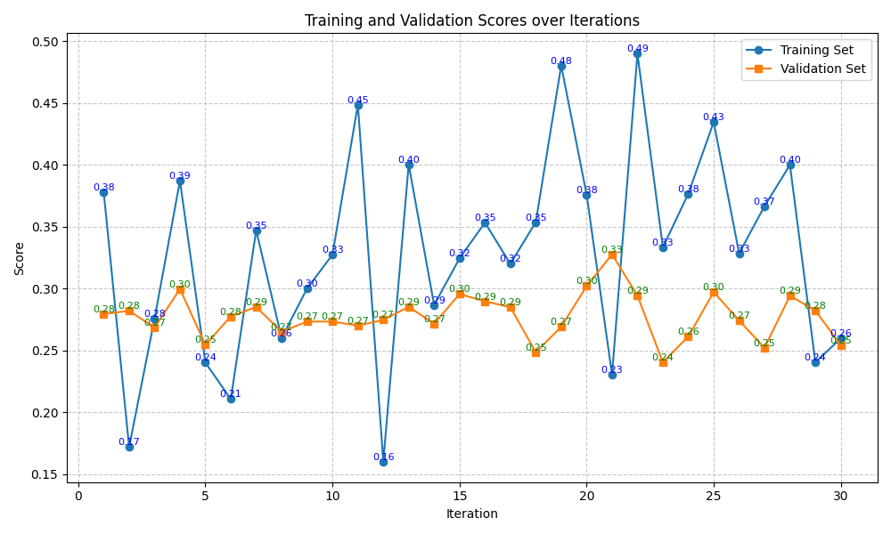
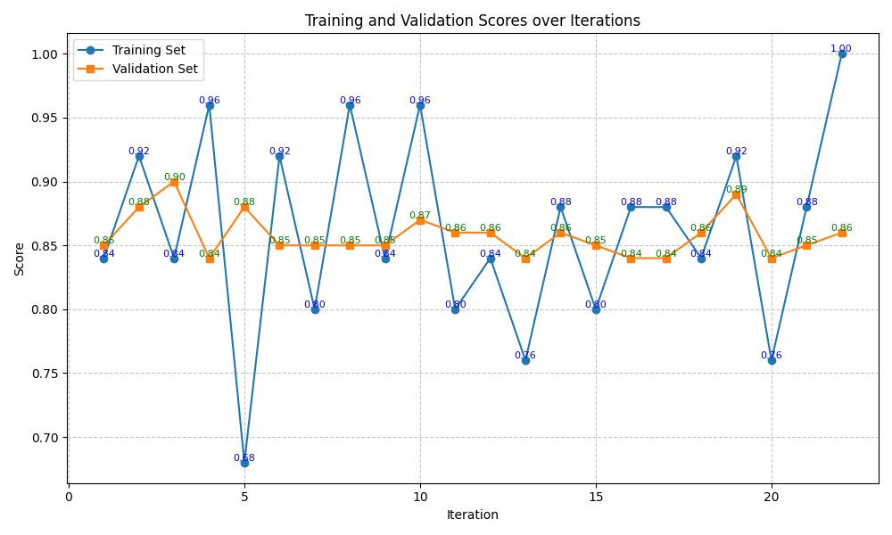
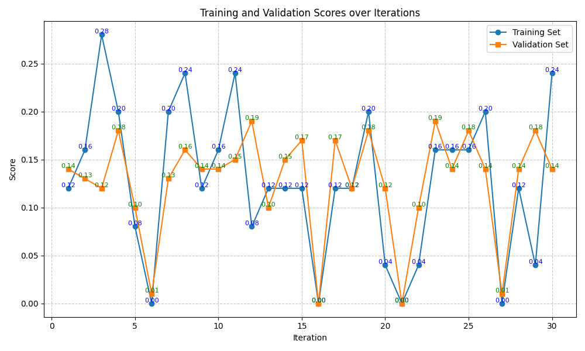
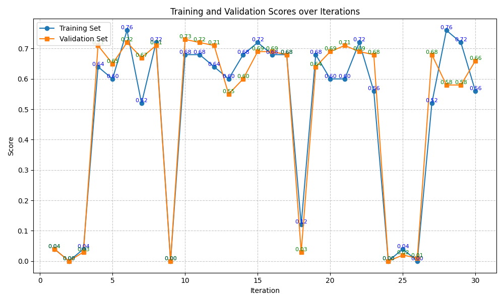
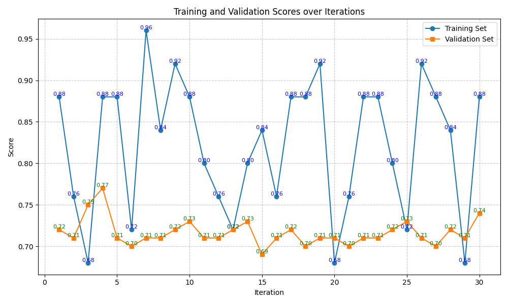

# OptunaTrainer Result

## Summary

### Trainset Scores

| Benchmarks \ Methods                   | Baseline | finetuned baseline | OptunaTrainer |
| -------------------------------------- | -------- | ------------------ | ------------- |
| BIRD-bench (SQL)                       | 0.291    | 0.449 (▲)          | **0.490** (▲) |
| BoolQ (QA)                             | 0.906    | **1.000** (▲)      | **1.000** (▲) |
| GPQA (Reasoning)                       | 0.186    | 0.184 (▼)          | **0.280** (▲) |
| MATH (Reasoning)                       | 0.626    | 0.566 (▼)          | **0.760** (▲) |
| New York Times Topics (Classification) | 0.836    | 0.914 (▲)          | **0.960** (▲) |

### Testset Scores

| Benchmarks \ Methods                   | Baseline | finetuned baseline | OptunaTrainer |
| -------------------------------------- | -------- | ------------------ | ------------- |
| BIRD-bench (SQL)                       | 0.307    | **0.473** (▲)      | 0.294 (▼)     |
| BoolQ (QA)                             | 0.850    | **0.892** (▲)      | 0.860 (▲)     |
| GPQA (Reasoning)                       | 0.146    | 0.080 (▼)          | 0.120 (▼)     |
| MATH (Reasoning)                       | 0.610    | 0.426 (▼)          | **0.720** (▲) |
| New York Times Topics (Classification) | 0.794    | **0.818** (▲)      | 0.710 (▼)     |

The OptunaTrainer shows higher performance improvement on the training dataset compared to other methods, including the finetuned baseline.
However, the performance improvement on the test set is not as clear.
For some datasets like BIRD-bench, GPQA, and New York Times Topics, the OptunaTrainer optimized prompt's performance is even lower than the baseline. This suggests that the OptunaTrainer is prone to overfitting.

## Benchmarks Results

### BIRD-bench

### BoolQ

### GPQA

### MATH

### New York Times Topics

## Future Work
