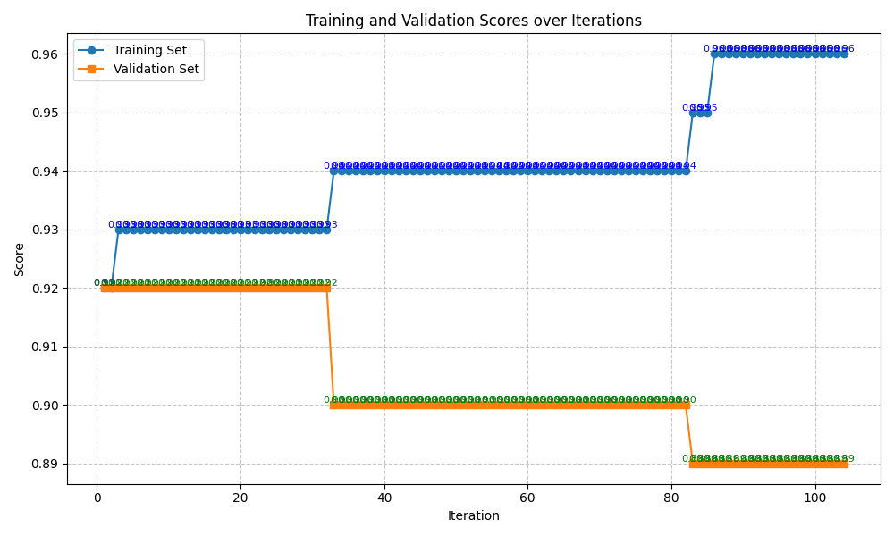
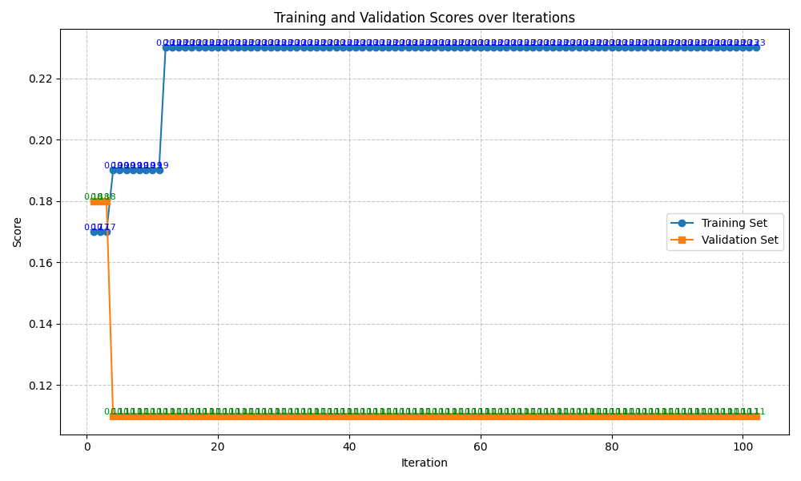
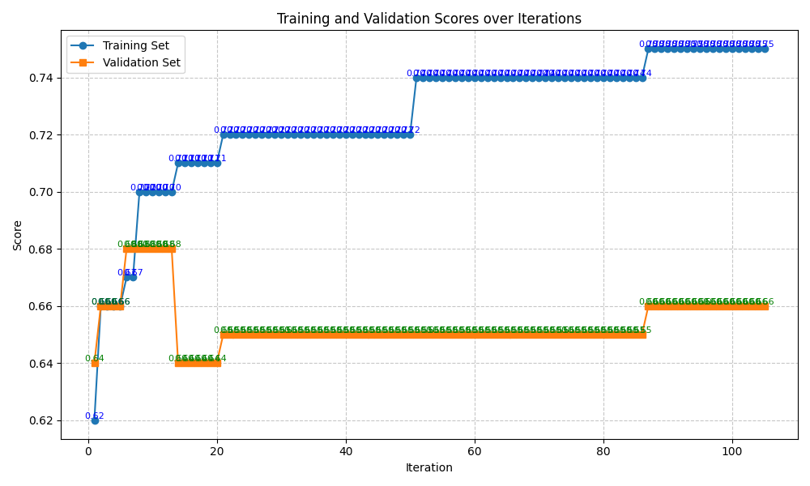
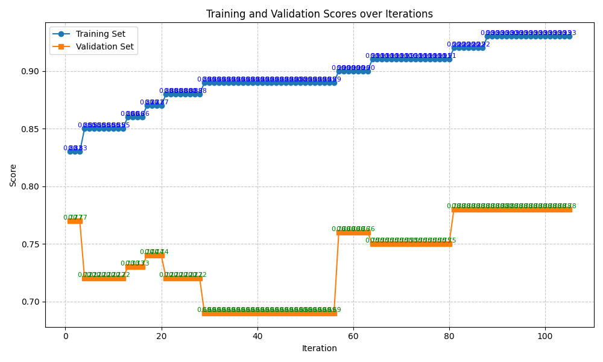

# TextGradEvoTrainer Result

## Summary

Compare to `TextGradientTrainer`

- It shows more stable performance in training dataset.
- It shows better performance in reasoning benchmarks in test set, but worse performance in classification and QA benchmarks in test set.
- Its hit count of textual gradient improvement is higher than `TextGradientTrainer`.

### Trainset Scores

| Benchmarks \ Methods                   | Baseline | finetuned baseline | TextGradEvoTrainer |
| -------------------------------------- | -------- | ------------------ | ------------------ |
| BIRD-bench (SQL)                       | 0.291    | **0.449** (▲)      | -                  |
| BoolQ (QA)                             | 0.906    | **1.000** (▲)      | 0.960 (▲)          |
| GPQA (Reasoning)                       | 0.186    | 0.184 (▼)          | **0.230** (▲)      |
| MATH (Reasoning)                       | 0.626    | 0.566 (▼)          | **0.750** (▲)      |
| New York Times Topics (Classification) | 0.836    | 0.914 (▲)          | **0.930** (▲)      |

### Testset Scores

| Benchmarks \ Methods                   | Baseline | finetuned baseline | TextGradEvoTrainer |
| -------------------------------------- | -------- | ------------------ | ------------------ |
| BIRD-bench (SQL)                       | 0.307    | **0.473** (▲)      | -                  |
| BoolQ (QA)                             | 0.850    | **0.892** (▲)      | 0.890 (▲)          |
| GPQA (Reasoning)                       | 0.146    | 0.080 (▼)          | 0.110 (▼)          |
| MATH (Reasoning)                       | 0.610    | 0.426 (▼)          | **0.660** (▲)      |
| New York Times Topics (Classification) | 0.794    | **0.818** (▲)      | 0.780 (▼)          |

### Hit Count Improvement

"Hit count" means the number of textual gradient that really improve the performance.

| Benchmarks \ Methods                   | TextGradientTrainer | TextGradEvoTrainer |
| -------------------------------------- | ------------------- | ------------------ |
| BIRD-bench (SQL)                       | 5                   | -                  |
| BoolQ (QA)                             | 0                   | 4 (▲)              |
| GPQA (Reasoning)                       | 3                   | 2 (▼)              |
| MATH (Reasoning)                       | 0                   | 7 (▲)              |
| New York Times Topics (Classification) | 2                   | 9 (▲)              |

## Benchmarks Results

### BIRD-bench

<!--  -->

### BoolQ

### GPQA

### MATH

### New York Times Topics

## Future Work
