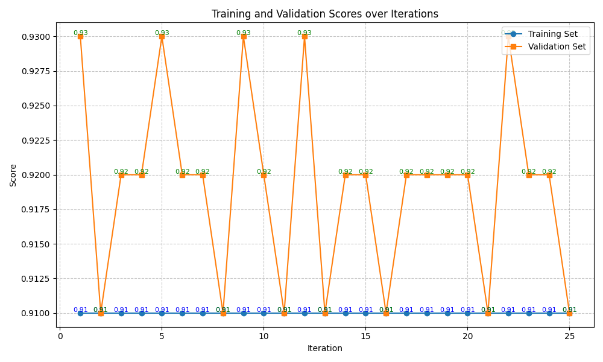
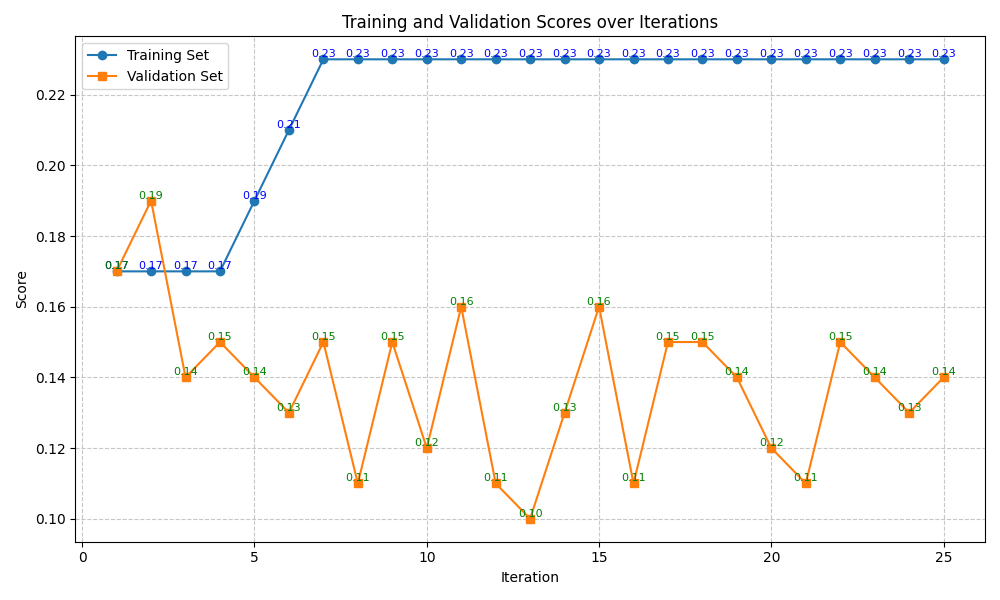
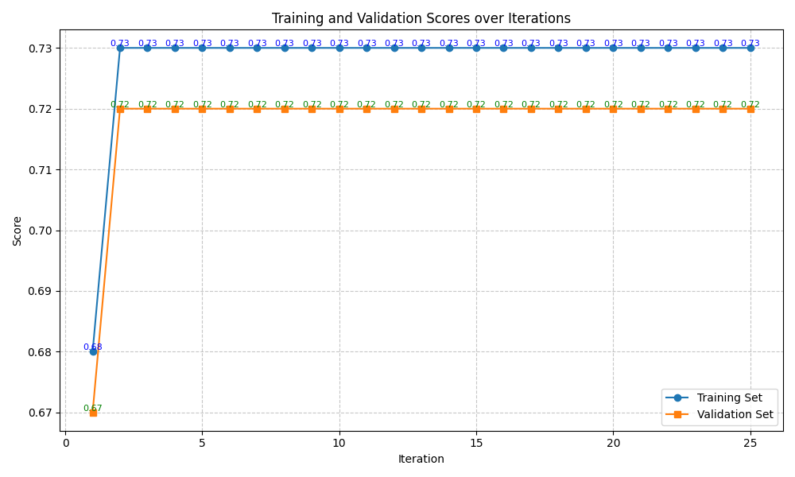
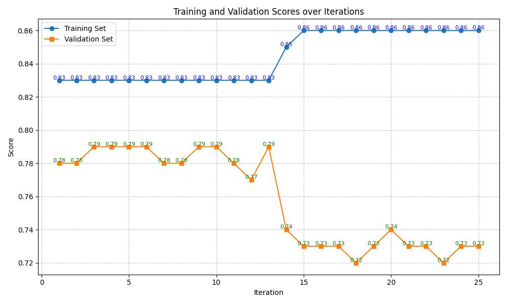

# TextGradientTrainer Result

## Summary

TextGradientTrainer shows good performance in MATH benchmark, but not so well in other benchmarks.

### Trainset Scores

| Benchmarks \ Methods                   | Baseline | finetuned baseline | TextGradientTrainer |
| -------------------------------------- | -------- | ------------------ | ------------------- |
| BIRD-bench (SQL)                       | 0.291    | **0.449** (▲)      | 0.394 (▲)           |
| BoolQ (QA)                             | 0.906    | **1.000** (▲)      | 0.910 (▲)           |
| GPQA (Reasoning)                       | 0.186    | 0.184 (▼)          | **0.230** (▲)       |
| MATH (Reasoning)                       | 0.626    | 0.566 (▼)          | **0.730** (▲)       |
| New York Times Topics (Classification) | 0.836    | **0.914** (▲)      | 0.860 (▲)           |

### Testset Scores

| Benchmarks \ Methods                   | Baseline | finetuned baseline | TextGradientTrainer |
| -------------------------------------- | -------- | ------------------ | ------------------- |
| BIRD-bench (SQL)                       | 0.307    | **0.473** (▲)      | 0.285 (▼)           |
| BoolQ (QA)                             | 0.850    | 0.892 (▲)          | **0.920** (▲)       |
| GPQA (Reasoning)                       | 0.146    | 0.080 (▼)          | 0.120 (▼)           |
| MATH (Reasoning)                       | 0.610    | 0.426 (▼)          | **0.720** (▲)       |
| New York Times Topics (Classification) | 0.794    | **0.818** (▲)      | 0.730 (▼)           |

## Benchmarks Results

### BIRD-bench

### BoolQ

### GPQA

### MATH

### New York Times Topics

## Future Work
