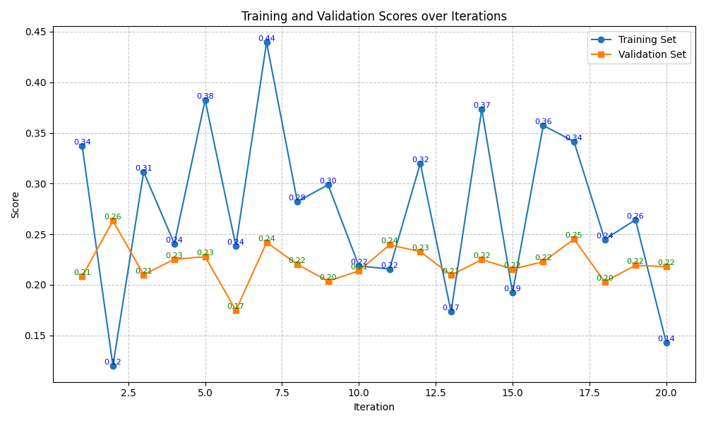
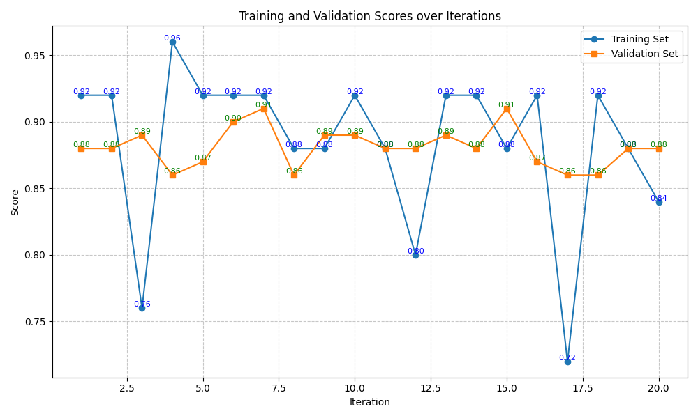
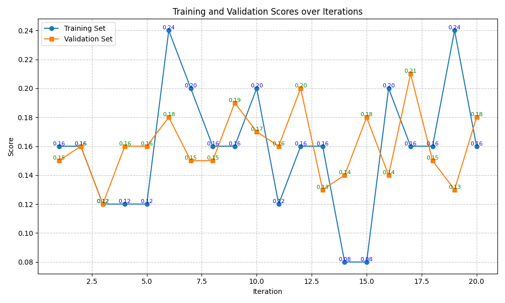
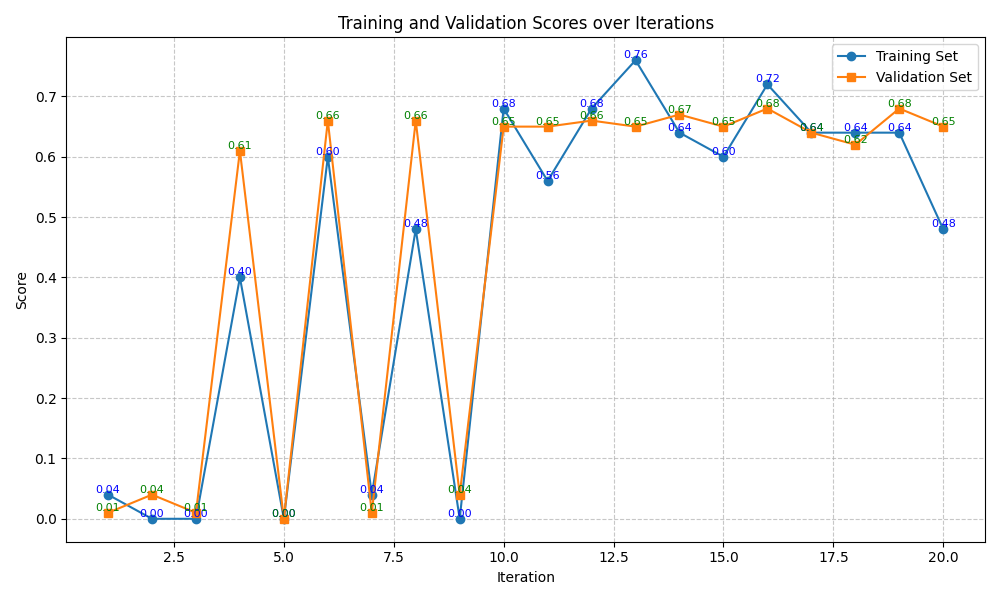
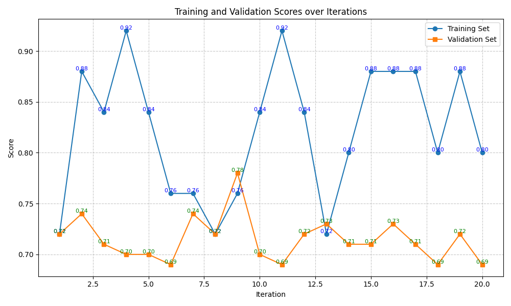

# DSPy-MIPRO Result

## Summary

### Trainset Scores

| Benchmarks \ Methods                   | Baseline | finetuned baseline | DSPy-MIPRO    |
| -------------------------------------- | -------- | ------------------ | ------------- |
| BIRD-bench (SQL)                       | 0.291    | **0.449** (▲)      | 0.439 (▲)     |
| BoolQ (QA)                             | 0.906    | **1.000** (▲)      | 0.960 (▲)     |
| GPQA (Reasoning)                       | 0.186    | 0.184 (▼)          | **0.240** (▲) |
| MATH (Reasoning)                       | 0.626    | 0.566 (▼)          | **0.760** (▲) |
| New York Times Topics (Classification) | 0.836    | 0.914 (▲)          | **0.920** (▲) |

### Testset Scores

| Benchmarks \ Methods                   | Baseline | finetuned baseline | DSPy-MIPRO    |
| -------------------------------------- | -------- | ------------------ | ------------- |
| BIRD-bench (SQL)                       | 0.307    | **0.473** (▲)      | 0.242 (▼)     |
| BoolQ (QA)                             | 0.850    | **0.892** (▲)      | 0.860 (▲)     |
| GPQA (Reasoning)                       | 0.146    | 0.080 (▼)          | **0.180** (▲) |
| MATH (Reasoning)                       | 0.610    | 0.426 (▼)          | **0.650** (▲) |
| New York Times Topics (Classification) | 0.794    | **0.818** (▲)      | 0.700 (▼)     |

## Benchmarks Results

DSPy-MIPRO shows good performance in reasoning benchmarks like MATH and GPQA.

### BIRD-bench

### BoolQ

### GPQA

### MATH

### New York Times Topics

## Future Work
