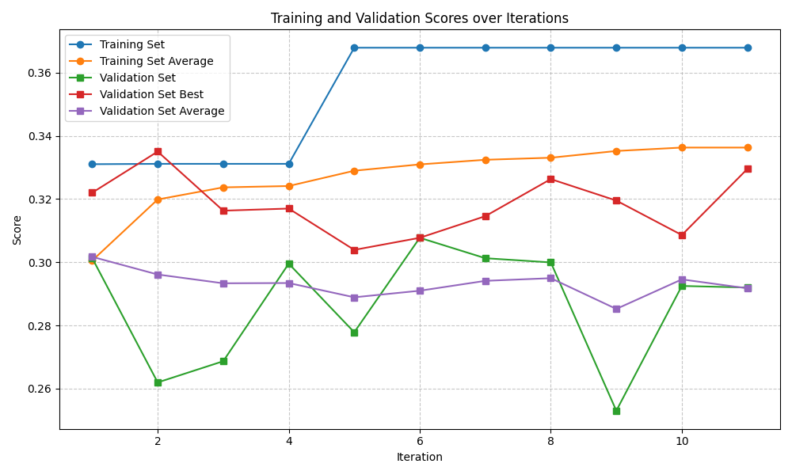
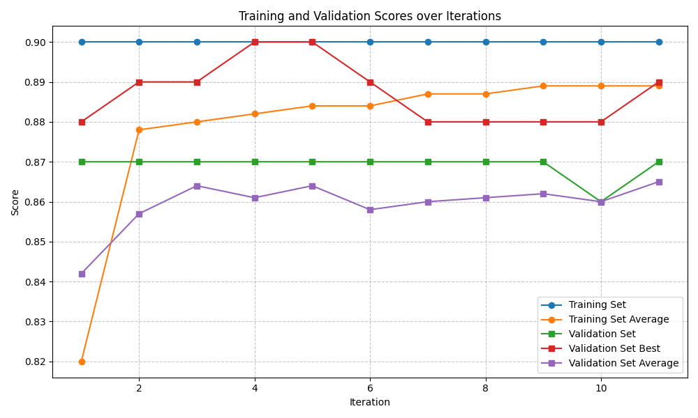
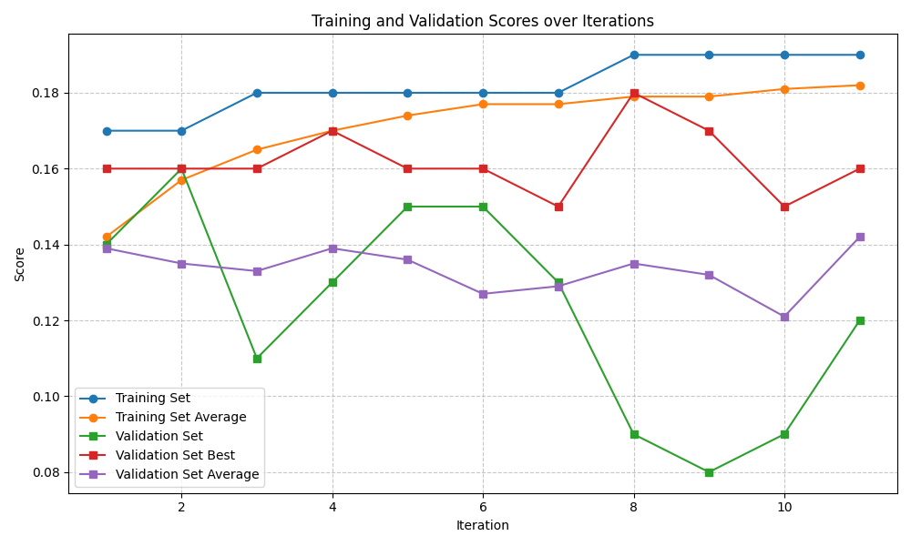
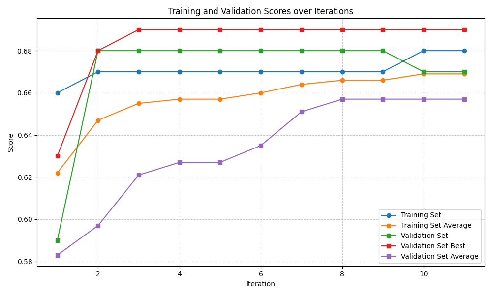
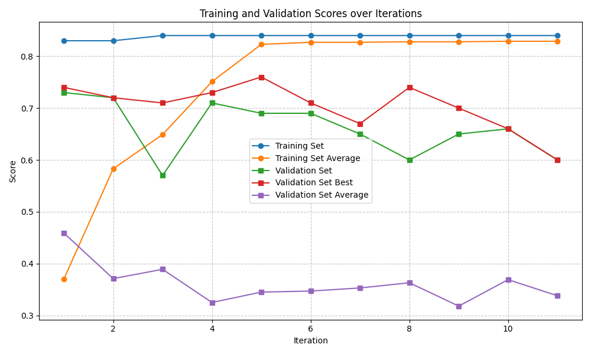

# EvoPrompt Result

## Summary

### Trainset Scores

| Benchmarks \ Methods                   | Baseline | finetuned baseline | EvoPrompt     |
| -------------------------------------- | -------- | ------------------ | ------------- |
| BIRD-bench (SQL)                       | 0.291    | **0.449** (▲)      | 0.368 (▲)     |
| BoolQ (QA)                             | 0.906    | **1.000** (▲)      | 0.900 (▼)     |
| GPQA (Reasoning)                       | 0.186    | 0.184 (▼)          | **0.190** (▲) |
| MATH (Reasoning)                       | 0.626    | 0.566 (▼)          | **0.680** (▲) |
| New York Times Topics (Classification) | 0.836    | **0.914** (▲)      | 0.840 (▲)     |

### Testset Scores

| Benchmarks \ Methods                   | Baseline | finetuned baseline | EvoPrompt     |
| -------------------------------------- | -------- | ------------------ | ------------- |
| BIRD-bench (SQL)                       | 0.307    | **0.473** (▲)      | 0.292 (▼)     |
| BoolQ (QA)                             | 0.850    | **0.892** (▲)      | 0.870 (▲)     |
| GPQA (Reasoning)                       | 0.146    | 0.080 (▼)          | 0.120 (▼)     |
| MATH (Reasoning)                       | 0.610    | 0.426 (▼)          | **0.670** (▲) |
| New York Times Topics (Classification) | 0.794    | **0.818** (▲)      | 0.600 (▼)     |

The frequency of performance improvements throughout the training process is notably low.
For BoolQ, no performance improvements were observed, while BIRD-bench and MATH showed only one instance of improvement each.

Furthermore, the performance improvements observed in the training dataset do not correlate well with those in the test dataset.

## Benchmarks Results

### BIRD-bench

### BoolQ

### GPQA

### MATH

### New York Times Topics

## Future Work
